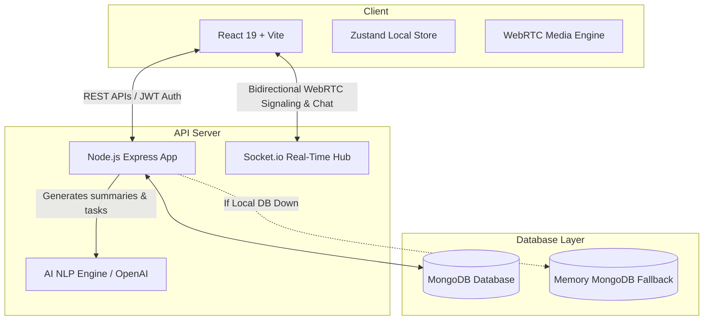

# IntellMeet – AI-Powered Enterprise Meeting & Collaboration Platform

IntellMeet is a production-grade full-stack MERN application combining real-time video conferencing, AI-powered meeting intelligence (live transcriptions, concise summaries, and action item extraction), team collaboration workspaces, drag-and-drop Kanban project boards, and engagement analytics.

Designed for modern remote/hybrid teams at enterprise scales, the platform automates meeting note-taking and turns every call into a trackable, actionable timeline.

---

## Technical Architecture & Core Layers



---

## Core Capabilities & Feature Set

- **User Authentication & Profiles (F-01):** Secure signup/login with JWT authorization, bcrypt password hashing, rate limiting, and auto-provisioned personal workspaces.
- **Real-Time Video Meetings (F-02):** Full WebRTC grid interface featuring local camera stream capture, real display screen-sharing toggles, local call recording utilizing browser `MediaRecorder` APIs, and presence sync.
- **AI Meeting Intelligence (F-03):** Automatically generates meeting summaries and extracts action items with priorities and owner names. Leverages OpenAI models with a robust local heuristic parser fallback.
- **Real-Time Chat & Collaboration (F-04):** Synchronized in-meeting chat channels with typing indicator animations and cooperative notepad synchronization across sockets.
- **Post-Meeting Dashboard (F-05):** Deep analytics summaries, searchable transcripts, media playback of recordings, and one-click task conversion converters.
- **Team Workspace Kanban Board (F-06):** Columns (To Do, In Progress, In Review, Done) supporting HTML5 drag-and-drop and manual task creators.
- **Analytics & Insights (F-07):** Highly optimized responsive SVG dashboards displaying weekly call frequency, duration splits, completion progress lines, and team engagement indices.

---

## Directory Structure

```text
IntellMeet/
├── backend/
│   ├── controllers/      # Route controllers (Auth, Meetings, Workspaces)
│   ├── middleware/       # JWT Auth protectors
│   ├── models/           # Mongoose schemas (User, Meeting, Workspace, Task)
│   ├── routes/           # REST Route endpoints
│   ├── services/         # Socket.io signaling & AI summarizer
│   ├── package.json      # Backend packages configuration
│   └── server.js         # Express app and sockets bootstrapper
├── frontend/
│   ├── src/
│   │   ├── components/   # UI elements (Sidebar navigation, headers)
│   │   ├── pages/        # Views (Dashboard, MeetingRoom, PostMeeting, Kanban, Analytics)
│   │   ├── api.ts        # HTTP Fetch client wrappers
│   │   ├── store.ts      # Zustand global state manager
│   │   ├── index.css     # CSS v4 directives, glass panels, animations
│   │   └── main.tsx      # React root rendering
│   ├── package.json      # Frontend packages configuration
│   └── vite.config.ts    # Tailwind compiler and dev proxies configuration
├── package.json          # Root orchestration script
└── README.md             # Developer documentation
```

---

## Local Development Guide

### Prerequisites
- [Node.js](https://nodejs.org/) v18.0 or newer (v24 recommended).
- [MongoDB](https://www.mongodb.com/) daemon (optional; the server automatically falls back to an in-memory database server if local connection fails).

### Setup Environment
1. Clone the project repository.
2. In the `backend` folder, create a `.env` file containing:
   ```env
   PORT=5000
   MONGODB_URI=mongodb://localhost:27017/intellmeet
   JWT_SECRET=super_secret_intellmeet_token_key_2026_xyz
   OPENAI_API_KEY=your_openai_api_key_here # Optional
   FORCE_SIMULATED_AI=true # Set true to run simulated NLP summaries offline
   ```

### Execution Steps
From the root workspace folder, execute:
```bash
# 1. Install all dependencies across root, backend, and frontend
npm run install:all

# 2. Spin up backend and frontend concurrently in development mode
npm run dev
```

The application will launch on:
- Frontend Client: [http://localhost:3000](http://localhost:3000)
- Backend Server API: [http://localhost:5000](http://localhost:5000)

---

## Production Deployment Specifications

### Docker Multi-Stage Build
Create a `Dockerfile` at the root folder to package the backend and compile frontend static assets:
```dockerfile
# Stage 1: Build Frontend
FROM node:24-alpine AS frontend-builder
WORKDIR /app/frontend
COPY frontend/package*.json ./
RUN npm install
COPY frontend/ ./
RUN npm run build

# Stage 2: Pack Server
FROM node:24-alpine
WORKDIR /app
COPY backend/package*.json ./backend/
RUN npm install --prefix backend --only=production
COPY backend/ ./backend/
COPY --from=frontend-builder /app/frontend/dist ./backend/public

EXPOSE 5000
ENV NODE_ENV=production
CMD ["node", "backend/server.js"]
```

---

## API Documentation Highlights

### Authentication Endpoints
- `POST /api/auth/register` : Registers profile & provisions first team workspace.
- `POST /api/auth/login` : Validates credentials & issues JWT tokens.
- `GET /api/auth/me` : Fetches profile context & workspace listings (Protected).

### Meetings Endpoints
- `POST /api/meetings` : Reserves meeting room code & title metadata (Protected).
- `GET /api/meetings` : Queries user session history (Protected).
- `PUT /api/meetings/:roomId/start` : Triggers live state & joins participants (Protected).
- `PUT /api/meetings/:roomId/end` : Suspends stream, compiles recordings, and triggers AI summarizes (Protected).

### Workspace & Kanban Endpoints
- `POST /api/workspaces` : Establishes new workspace (Protected).
- `GET /api/workspaces/:id` : Returns member rosters & Kanban task cards (Protected).
- `POST /api/workspaces/:id/tasks` : Appends new task card to column (Protected).
- `PUT /api/workspaces/tasks/:taskId` : Modifies task text, assignees, or moves columns (Protected).
